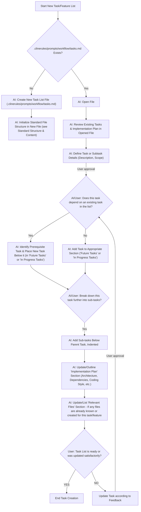

<!-- Canonical: .github/create-ai-task.prompt.md (en) | Übersetzung: de — last updated: 2025-08-21 -->

# Protokoll: Feature- & Aufgaben-Definition

Beschreibung: Protokoll zum Definieren neuer Features, Aufgaben und Unteraufgaben. Führt durch das Erstellen/Aktualisieren von Aufgabenlisten-Dateien, strukturiert Aufgaben, behandelt Abhängigkeiten und skizziert Implementierungspläne. Beinhaltet einen visuellen Workflow.

Wenn ein Benutzer die Erstellung oder Hinzufügung neuer Features, Aufgaben oder Unteraufgaben initiiert, befolge dieses Protokoll. Es stellt sicher, dass die Definition vollständig ist und korrekt in die Projekt-Aufgabenlisten integriert wird.

## Workflow-Übersicht

Das folgende Mermaid-Diagramm veranschaulicht den Schritt-für-Schritt-Prozess zur Feature- und Aufgaben-Definition:

## Wichtige Anweisungen für die KI basierend auf dem Workflow

1. **Initiation (AAA -> NEW_A):** Wenn der Benutzer eine Aufgabe oder ein Feature hinzufügen/erstellen möchte, **beginne immer damit, die Aufgaben aus `.clinerules/prompts/workflow/tasks.md` zu laden**.
2. **Datei-Handhabung (NEW_B -> NEW_C):**
   - Wenn sie **existiert** (`NEW_B`), öffne sie und überprüfe den aktuellen Inhalt (`AAG`) gegebenenfalls gemeinsam mit dem Benutzer.
   - Wenn sie **nicht existiert** (`NEW_C`), erstelle die Datei.
3. **Standardstruktur & Inhalt:** Falls eine neue Datei erstellt wird oder die Datei leer ist, **initialisiere sie mit den Standardabschnitten** (`# [Feature Name] Implementation`, `## Completed Tasks`, `## In Progress Tasks`, `## Future Tasks`, `## Implementation Plan`, `### Relevant Files`).
4. **Aufgaben-Definition (AAG -> AAH_PRE):** Definiere die neue Aufgabe oder Unteraufgabe kollaborativ mit dem Benutzer. **Sei immer skeptisch** und frage nach Klarstellung, falls die Aufgabenbeschreibung nicht klar oder unvollständig ist. Sorge für eine klare Beschreibung und einen klaren Umfang. Mögliche erforderliche Schritte:
   - Dateien erstellen oder ändern
   - Code testen
   - CLI-Befehle ausführen
   - Tests schreiben
   - Tests ausführen
   - Screenshots aus UI/Frontend erstellen
   - Implementierung durch Tests verifizieren
   - Kommentare/Dokumentation aktualisieren
   - Umstrukturieren oder Refactoring
5. **Abhängigkeitsprüfung (AAH_DEP):** **Ermittle, ob die neue Aufgabe von einer bestehenden Aufgabe in der Liste abhängt.** Wenn unsicher, frag nach.
   - Wenn **ja** (`AAH_POS`), stelle sicher, dass die neue Aufgabe direkt unter der voraussetzenden Aufgabe platziert wird.
   - Wenn **nein** (`AAH`), füge sie in den passenden Abschnitt ein.
6. **Aufgaben-Formatierung:**
   - Alle Aufgaben und Unteraufgaben **müssen** GitHub-Style-Checkboxen verwenden: `- [ ]` für unvollständige Aufgaben.
   - Unteraufgaben sollten eingerückt unter der übergeordneten Aufgabe stehen.
7. **Unteraufgaben-Aufteilung (AAI -> AAJ):** Nachdem eine Hauptaufgabe definiert ist, **frage den Benutzer, ob sie weiter in Unteraufgaben zerlegt werden soll.** Falls ja, füge diese Unteraufgaben eingerückt unter der Elternaufgabe hinzu.
8. **Implementierungsplan (AAK):** Hilf dem Benutzer, die Sektion `## Implementation Plan` zu aktualisieren oder zu skizzieren. Frage nach Details wie:
   - Entscheidende Architekturentscheidungen.
   - Abhängigkeiten (npm-Pakete, Dienste, benötigte Abstraktionsebenen).
   - Bevorzugter Programmierstil (prozedural, funktional, klassenbasiert), falls relevant. Frage nach Codebeispielen oder Style-Guides, wenn vorhanden.
   - **Wichtig:** Wenn diese Details nicht vom Benutzer angegeben sind und derzeit unbekannt sind, frage, wo diese Informationen zu finden sind (z. B. bestehende Dokumentation) oder fordere die Informationen direkt an. Betone die Wichtigkeit, den Implementierungsplan zu dokumentieren.
   - **Sei stets skeptisch** und fordere Klarstellungen, falls der Plan widersprüchlich oder unvollständig ist.
9. **Relevante Dateien (AAL):** Bitte den Benutzer, alle bereits bekannten oder erstellten relevanten Dateien aufzulisten, die für diese Aufgabe/Feature wichtig sind.
10. **Bestätigung (AAM):** Bevor Du abschließt, bestätige mit dem Benutzer, dass die Aufgabenliste aktualisiert oder erstellt wurde und zufriedenstellend ist. Falls nicht, starte den Workflow entsprechend dem Feedback neu.

## Allgemeine Erinnerungen

- Halte dich beim Erstellen oder Ändern von Aufgabenlisten immer an die vorgegebene Dateistruktur.
- Stelle sicher, dass Aufgabenbeschreibungen klar und umsetzbar sind.
- Verweise bei Bedarf auf das Mermaid-Diagramm als visuelle Anleitung für den Ablauf und die Benutzerinteraktionen.
