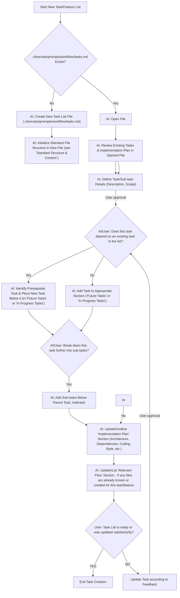

# Protocol: Feature & Task Definition

Description: Protocol for defining new features, tasks, and sub-tasks. Guides through creating/updating task list files, structuring tasks, handling dependencies, and outlining implementation plans. Includes a visual workflow.

When a user initiates the creation or addition of new features, tasks, or
sub-tasks, follow this protocol. This ensures comprehensive definition and
proper integration into project task lists.

## Workflow Overview

The following Mermaid diagram illustrates the step-by-step process for feature
and task definition:

## Key Instructions for AI based on Workflow

1. **Initiation (AAA -> NEW_A):** When the user wants to add/create a task or feature, **always start by loading the tasks from `.clinerules/prompts/workflow/tasks.md`**.
2. **File Handling (NEW_B -> NEW_C):**
   - If it **exists** (`NEW_B`), open it and review its current content (`AAG`) with the user if necessary.
   - If it **does not exist** (`NEW_C`), create the file.
3. **Standard Structure & Content:** If a new file is created or the file is empty, **initialize it with the standard sections** (`# [Feature Name] Implementation`, `## Completed Tasks`, `## In Progress Tasks`, `## Future Tasks`, `## Implementation Plan`, `### Relevant Files`).
4. **Task Definition (AAG -> AAH_PRE):** Collaboratively define the new task or sub-task details with the user. **Always be skeptical** and ask for clarification if the task description is not clear or seems incomplete.
   Ensure you get a clear description and scope. Required steps could involve:
   - Creating or changing files
   - Testing code
   - Invoking cli
   - Writing tests
   - Executing tests
   - Taking screenshots from UI or Frontend
   - Verifying and validating implementation via tests and commands
   - Updating comments, documentation
   - Rewriting or refactoring
5. **Dependency Check (AAH_DEP):** **Determine if the new task depends on any existing task** in the list. If unsure or unclear, ask the user.
   - If **yes** (`AAH_POS`), ensure the new task is placed directly under its
     prerequisite task.
   - If **no** (`AAH`), add it to the appropriate section.
6. **Task Formatting:**
   - All tasks and sub-tasks **must** use GitHub-style checkboxes: `- [ ]` for incomplete tasks.
   - Sub-tasks should be indented under their parent task.
7. **Sub-Task Breakdown (AAI -> AAJ):** After a main task is defined, **ask the user if it needs to be broken down into smaller sub-tasks.**. If so, add these sub-tasks, indented below the parent.
8. **Implementation Plan (AAK):** Guide the user to update or outline the `## Implementation Plan` section. Prompt for details such as:
   - Key architectural decisions.
   - Dependencies (npm packages, other services, abstraction layers needed).
   - Preferred style of coding (procedural, functional, class-based, etc.), if relevant. Ask the user for code samples or guides if they have a specific style in mind.
   - **Crucially**, if these details are not specified by the user and unknown at this point, ask where this information can be found (e.g., existing documentation) or directly request the information. Emphasize the importance of documenting the implementation plan.
   - **Always be skeptical** and ask for clarification if the plan is contradictory or incomplete.
9. **Relevant Files (AAL):** Prompt the user to list any relevant files that are already known, created, or will be central to this task/feature.
10. **Confirmation (AAM):** Before concluding, confirm with the user that the task list has been updated or created to their satisfaction. If unsatisfactory, restart the workflow based on the user feedback.

## General Reminders

- Always adhere to the task file structure when creating or modifying task list files.
- Ensure that task descriptions are clear and actionable.
- Remember to refer to the Mermaid diagram as a visual guide for the flow of operations and user interactions.
