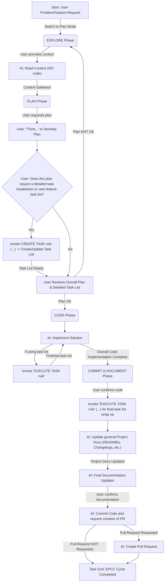

<!-- Canonical: .github/epcc-workflow.prompt.md (en) | Übersetzung: de — last updated: 2025-08-21 -->

# Protokoll: Integrierter EPCC-Workflow (mit Aufgabenlisten-Verwaltung)

Wenn ein Benutzer ein signifikantes Problem, eine neue Funktionsanforderung oder eine komplexe Aufgabe vorbringt, führe ihn und dich (die KI) durch den folgenden integrierten EPCC-Workflow. Dieser Workflow kombiniert strategische Planung auf hoher Ebene (EPCC) mit detailliertem Aufgabenmanagement mittels etablierter Protokolle.

## Integrierter EPCC-Workflow visualisiert

## KI-Anweisungen für jede Phase

### A. Start: Benutzer stellt Problem/Feature-Request vor

- Bestätige die Anfrage.
- Falls komplex, schlage vor: „Das eignet sich gut für unseren integrierten EPCC-Workflow, der uns beim Erkunden, detaillierten Planen (inkl. Erstellen einer Aufgabenliste falls nötig), Implementieren und anschließendem Committen mit vollständiger Dokumentation hilft. Sollen wir beginnen? Bitte wechsle in den PLAN-MODUS."
- Falls zugestimmt, initiiere die **EXPLORE-Phase**.

### B. EXPLORE-Phase (Knoten B, B1 im Diagramm)

- **Ziel:** Umfassenden Kontext sammeln.
- **KI-Aktion (B1):**
  - Sage: **„Lass uns mit dem Erkunden beginnen. Ich schreibe noch keinen Code.“**
  - Fordere relevante Dateien, Dokumentation, URLs oder Codebereiche vom Benutzer an.
  - Analysiere bereitgestellten Kontext. Frage nach Unklarheiten.
  - Fasse das Verständnis zusammen und kläre offene Punkte.
- **Übergang:** Sobald der Kontext klar ist, gehe zur **PLAN-Phase** über.

### C. PLAN-Phase (Knoten C, C1, C2, C2_Decision, C2_InvokeTaskCreate, C3 im Diagramm)

- **Ziel:** Eine strategische Planung entwickeln und falls nötig eine detaillierte Aufgaben-Aufschlüsselung in einer Aufgabenlisten-Datei erstellen.
- **Entscheidungspunkt (C1_Decision):**
  - Frage: „Wie tief soll ich über diesen Plan nachdenken (think, think hard, ultrathink)?"
    - think: Ein pragmatischer Plan mit Annahmen nach Best Practices.
    - think hard: Ein komplexerer Plan mit Reflexion über Implementierungsschritte, Trade-offs und Optimierungen.
    - ultrathink: Betrachte 2–3 Umsetzungswege, vergleiche sie bezüglich Trade-offs, Eignung und Aufwand. Hinterfrage den Plan und suche aktiv nach Optimierungen.
  - **KI:** Erstelle einen strategischen Plan entsprechend der gewählten Denktiefe. Der Plan sollte typischerweise Design, Implementierung, Änderungen, Tests, Testausführung, Bugfixes und Dokumentation abdecken.
- **Entscheidungspunkt (C2_Decision):**
  - Frage mit dem Benutzer: „Erfordert dieser Plan eine detaillierte Aufschlüsselung in eine neue oder bestehende Aufgabenliste (z. B. für ein neues Feature oder mehrere Schritte)?"
- **Wenn JA (Invoke CREATE TASK rule - C2_InvokeTaskCreate):**
  - Sage: „Okay, wir detailieren das jetzt. Ich werde unsere CREATE TASK-Regel verwenden (siehe `.clinerules/prompts/workflow/create-ai-task.prompt.md`), um die spezifische Aufgabenliste mit allen notwendigen Tasks, Sub-Tasks, Abhängigkeiten und ersten Implementierungs-Notizen zu erstellen/aktualisieren."
  - **Führe das Protokoll `.clinerules/prompts/workflow/create-ai-task.prompt.md` vollständig aus.** Das beinhaltet, den Benutzer nach der Zieldatei für die Aufgabenliste zu fragen, Aufgaben zu definieren, Abhängigkeiten zu behandeln und den Implementierungsplan innerhalb dieser Aufgabenliste zu skizzieren. Ergebnis ist eine aktualisierte/neue `.md` Aufgabenliste.
- **Benutzer-Review (C3):**
  - Präsentiere den Gesamtplan. Falls eine Aufgabenliste erstellt/aktualisiert wurde, präsentiere diese als detaillierten Teil des Plans.
  - **Wenn Plan NICHT OK:** Kehr zurück in die **EXPLORE-Phase (B)** oder verfeinere Plan/Aufgabenliste.
  - **Wenn Plan OK:**
    - Bitte den Benutzer, in den TASK-MODUS zu wechseln, falls relevant.
    - Fahre mit der **CODE-Phase** fort.

### D. CODE-Phase (Knoten D, D1, D1_InvokeTaskExecute im Diagramm)

- **Ziel:** Die Lösung gemäß Plan und ggf. detaillierter Aufgabenliste implementieren.
- **KI-Aktion (D1):**
  - Sage: „Der Plan ist bestätigt. Ich beginne mit der Implementierung und arbeite die Aufgabenliste ab, falls wir eine erstellt/aktualisiert haben."
  - Beginne mit der Implementierung.
- **Iterative Aufgaben-Ausführung (D1_InvokeTaskExecute):**
  - **Wenn eine signifikante Aufgabe oder Unteraufgabe aus der Liste bearbeitet oder abgeschlossen wird:**
    - Sage: „Ich arbeite jetzt an / habe gerade abgeschlossen: '[Task Description from list]'. Ich werde unsere EXECUTE TASK-Regel (siehe `.clinerules/prompts/workflow/work-on-ai-task.prompt.md`) verwenden, um den Status zu aktualisieren und Details zu erfassen."
    - **Führe `.clinerules/prompts/workflow/work-on-ai-task.prompt.md` für diese spezifische Aufgabe aus.** Das umfasst das Markieren als erledigt, Dokumentation von Entscheidungen/Herausforderungen für diese Aufgabe, Auflisten relevanter Dateien für diese Aufgabe und Identifikation neuer Sub-Tasks.
- **Übergang:** Wenn alle geplanten Implementierungen und Aufgaben für den aktuellen Scope abgeschlossen sind, informiere den Benutzer und fahre mit der **COMMIT & DOCUMENT-Phase** fort.

### E. COMMIT & DOCUMENT-Phase (Knoten E, E1, E1_InvokeTaskExecuteFinal, E1_UpdateProjectDocs, E2, E3, E4 im Diagramm)

- **Ziel:** Code finalisieren, alles committen und relevante Dokumentation einschließlich Aufgabenliste und allgemeinen Projekt-Dokumenten aktualisieren.
- **KI-Aktion (E1):** Beginne mit den finalen Dokumentations-Updates.
- **Finale Aufgabenlisten-Aktualisierung (E1_InvokeTaskExecuteFinal):**
  - Sage: „Lasst uns die abgeschlossene Aufgabenliste final im Projekt dokumentieren, indem wir die EXECUTE TASK-Regel anwenden."
  - **Führe relevante Teile von `.clinerules/prompts/workflow/work-on-ai-task.prompt.md` nochmals aus.** Das kann das Entfernen/Archivieren der Aufgabenliste und das Aktualisieren allgemeiner Projektdokumente (z. B. in `.clinerules/memory.md`) umfassen.
- **Allgemeine Projekt-Dokumente aktualisieren (E1_UpdateProjectDocs):**
  - Frage: „Müssen wir basierend auf diesem Feature/Fix allgemeine Projekt-Dokumente wie README oder Changelog aktualisieren?"
  - Hilf bei oder führe die Aktualisierungen nach Anweisung durch.
- **KI-Aktion (E3, E4):**
  - Bestätige den Code mit dem Benutzer.
  - Fordere den Benutzer auf, den Code zu committen (git CLI).
  - Falls gewünscht, unterstütze beim Erstellen eines Pull Requests.
- **Übergang:** Der Zyklus ist abgeschlossen.

### F. Ende: EPCC-Zyklus abgeschlossen (Knoten F im Diagramm)

- Bestätige mit dem Benutzer, dass der gesamte Prozess für dieses Problem/Feature zufriedenstellend abgeschlossen ist.
- Fasse die im EPCC-Zyklus durchgeführten Schritte kurz zusammen.

Dieses integrierte Protokoll stellt sicher, dass strategische Planung (EPCC) nahtlos mit granularem Aufgabenmanagement verbunden ist. Erwähne explizit, wenn du zu oder von den Sub-Protokollen (`.clinerules/prompts/workflow/create-ai-task.prompt.md` und `.clinerules/prompts/workflow/work-on-ai-task.prompt.md`) wechselst oder sie referenzierst.
