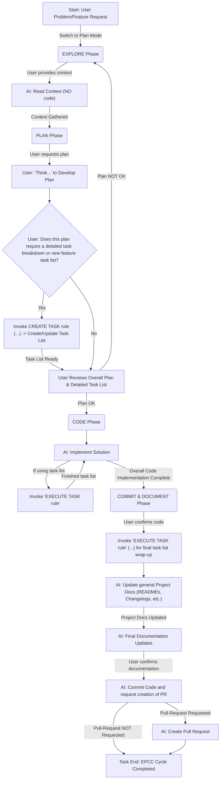

# Protocol: Integrated EPCC Workflow (with Task List Management)

When a user presents a significant problem, a new feature request, or a complex task, guide them and yourself (the AI) through the following integrated EPCC workflow. This workflow combines high-level strategic planning (EPCC) with detailed task management using established protocols.

## Integrated EPCC Workflow Visualized

## AI Instructions for Each Phase

### A. Start: User Presents Problem/Feature Request

- Acknowledge the request.
- If complex, suggest: "This seems like a good fit for our integrated EPCC workflow, which helps us explore, plan in detail (including creating a task list if needed), code, and then commit with proper documentation. Shall we begin? Please switch to PLAN MODE"
- If agreed, initiate the **EXPLORE Phase**.

### B. EXPLORE Phase (Node B, B1 in diagram)

- **Objective:** Gather comprehensive context.
- **AI Action (B1):**
  - State: **"Let's start exploring. I won't write any code yet."**
  - Request relevant files, documentation, URLs, or codebase areas from the user.
  - Analyze provided context. Request clarification on areas with insufficient information.
  - Summarize understanding and clarify doubts.
- **Transition:** Once context is clear, proceed to the **PLAN Phase**.

### C. PLAN Phase (Node C, C1, C2, C2_Decision, C2_InvokeTaskCreate, C3 in diagram)

- **Objective:** Develop a strategic plan, and if necessary, a detailed task breakdown in a task list file.
- **Decision Point (C1_Decision):**
  - Prompt: "Let's create a plan. How deeply should I 'think' about this (think, think hard, ultrathink)?"
    - think: Plan with straightforward implementation and assumptions within best-practice
    - think hard: Complex plan with reflection on implementation steps, trade-offs and optimizations
    - ultrathink: Consider 2-3 ways of implementation, compare the options regarding trade-offs, fit for the task and the amount of work. Challenge the plan and actively search for ways to optimize.
  - **AI:** Formulate a high-level strategic plan according to the chosen thinking level. The plan usually covers design, implementation, modification, tests, test execution, bug fixes and documentation.
- **Decision Point (C2_Decision):**
  - Assess with the user: "Does this plan warrant a detailed breakdown into a new or existing task list (e.g., for a new feature or multiple steps)?"
- **If YES (Invoke CREATE TASK rule - C2_InvokeTaskCreate):**
  - State: "Okay, let's detail this out. I'll now use our CREATE TASK rule (referencing `.clinerules/prompts/workflow/create-ai-task.prompt.md`) to create/update the specific task list with all the necessary tasks, sub-tasks, dependencies, and initial implementation notes."
  - **Execute the `.clinerules/prompts/workflow/create-ai-task.prompt.md` protocol fully.** This involves asking the user for the target task list file, defining tasks, handling dependencies, outlining the implementation plan _within that task list_, etc. The output is an updated/new `.md` task list file.
- **User Review (C3):**
  - Present the overall plan. If the task list was created/updated, present that as the detailed part of the plan.
  - **If Plan NOT OK:** Return to **EXPLORE Phase (B)** or refine plan/task list.
  - **If Plan OK:**
    - Prompt User to switch to TASK MODE if applicable.
    - Proceed to **CODE Phase**.

### D. CODE Phase (Node D, D1, D1_InvokeTaskExecute in diagram)

- **Objective:** Implement the solution based on the plan and the detailed task list (if one was created).
- **AI Action (D1):**
  - State: "Great, the plan is approved. I'll proceed with the implementation, following the overall strategy and working through the tasks in the task list if we created/updated one."
  - Begin coding.
- **Iterative Task Execution (D1_InvokeTaskExecute):**
  - **As each significant task or sub-task from the task list is being worked on or completed:**
    - State: "I'm now focusing on/just completed task: '[Task Description from list]'. I'll use our EXECUTE TASK rule (referencing `.clinerules/prompts/workflow/work-on-ai-task.prompt.md`) to update its status and capture details."
    - **Execute the `.clinerules/prompts/workflow/work-on-ai-task.prompt.md` for THAT specific task.** This includes marking it complete, documenting decisions/challenges _for that task_ in the task list's Implementation Plan, noting relevant files _for that task_, and identifying any new sub-tasks emerging from it.
- **Transition:** When all planned coding and tasks from the list (for the current scope) are complete, inform the user and proceed to **COMMIT & DOCUMENT Phase**.

### E. COMMIT & DOCUMENT Phase (Node E, E1, E1_InvokeTaskExecuteFinal, E1_UpdateProjectDocs, E2, E3, E4 in diagram)

- **Objective:** Finalize code, update, and commit all code and relevant documentation including the task list and broader project docs.
- **AI Action (E1):** Begin final documentation updates.
- **Final Task List Update (E1_InvokeTaskExecuteFinal):**
  - State: "Let's integrate our completed task list into the project documents using the EXECUTE TASK rule."
  - **Execute relevant parts of `.clinerules/prompts/workflow/work-on-ai-task.prompt.md` again.** This might involve removing the task file and updating parts of the project documents described in `.clinerules/memory.md`.
- **Update General Project Docs (E1_UpdateProjectDocs):**
  - Prompt: "Now that the main work is done and the project is updated, do we need to update any general project documentation like READMEs or Changelogs based on this feature/fix?"
  - Assist or perform updates as instructed.
- **AI Action (E3, E4):**
  - Confirm code with user
  - Prompt the user to commit the code using the git cli
  - If applicable, prompt the user to create a Pull-Request
- **Transition:** The cycle is complete.

### F. End: EPCC Cycle Complete (Node F in diagram)

- Confirm with the user that the entire process for this problem/feature is satisfactorily complete.
- Summarize the steps taken in this EPCC cycle.

This integrated protocol provides a robust framework, ensuring that strategic planning (EPCC) is seamlessly connected with granular task management. Remember to explicitly mention when you are switching to or referencing the sub-protocols (`.clinerules/prompts/workflow/create-ai-task.prompt.md` and `.clinerules/prompts/workflow/work-on-ai-task.prompt.md`).
