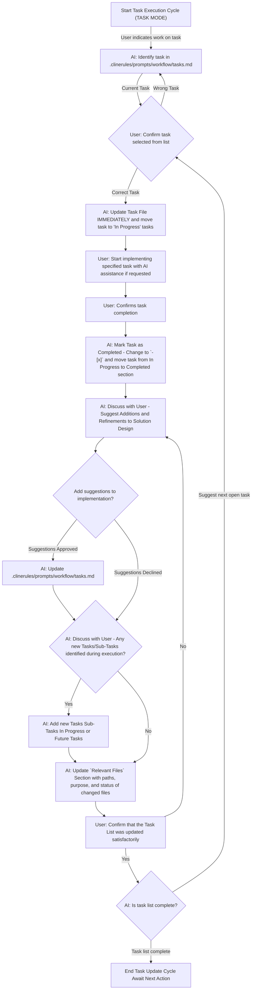

<!-- Canonical: .github/work-on-ai-task.prompt.md (en) | Übersetzung: de — last updated: 2025-08-21 -->

# Protokoll: Aufgaben-Ausführung & Aktualisierung

Beschreibung: Protokoll zur Ausführung von Aufgaben aus einer Aufgabenliste, Aktualisierung ihres Status, Dokumentation von Entscheidungen, Markieren relevanter Dateien und Vorschlägen zur Verfeinerung des Lösungsdesigns. Beinhaltet einen visuellen Workflow.

Wenn ein Benutzer angibt, dass er an einer Aufgabe aus einer Aufgabenliste arbeitet oder eine Aufgabe abgeschlossen hat, folge diesem Protokoll. So ist sichergestellt, dass Aufgaben korrekt aktualisiert werden und relevante Informationen erfasst werden. Du agierst als erstklassiger Entwickler, der den Benutzer bei der Erledigung der Aufgabenliste unterstützt.

## Workflow-Übersicht

Das folgende Mermaid-Diagramm veranschaulicht den Schritt-für-Schritt-Prozess für die Aufgaben-Ausführung und Aktualisierung der Aufgabenliste:

## Wichtige Anweisungen für die KI basierend auf dem Workflow

1. **Initiation (A → B):** Wenn der Benutzer erwähnt, dass er eine Aufgabe startet, daran arbeitet oder abgeschlossen hat, identifiziere zuerst die spezifische Aufgabe in der Projekt-Aufgabenlisten-Datei (z. B. `.clinerules/prompts/workflow/tasks.md`). Wenn die Aufgabe unklar ist, frage nach.
2. **Aufgaben-Bestätigung (B → C → D):** Bestätige mit dem Benutzer die ausgewählte Aufgabe und verweise auf die Beschreibung und relevante Notizen im `Implementation Plan`. Nach Bestätigung aktualisiere die Aufgabenliste sofort, indem du die Aufgabe in `## In Progress Tasks` verschiebst.
3. **Aufgaben-Implementierung (D → E):** Der Benutzer implementiert die Aufgabe. Biete Unterstützung falls angefordert, aber der Benutzer führt die Implementierung durch.
4. **Meldung über Abschluss (E → F):** Warte auf die Bestätigung des Benutzers, dass die Aufgabe abgeschlossen ist.
5. **Sofortige Aufgaben-Datei-Aktualisierung (F → G):**
   - Finde die Aufgabe in `## In Progress Tasks`.
   - Ändere die Checkbox von `- [ ]` zu `- [x]`.
   - Verschiebe den Aufgaben-Eintrag in die Sektion `## Completed Tasks`.
6. **Kontextuelle Kommentare (G):** Schlage vor, einen kontextuellen Kommentar zur abgeschlossenen Aufgabe hinzuzufügen (z. B. Abschlussdatum, PR-Nummer). Wenn der Benutzer zustimmt, aktualisiere den Aufgaben-Eintrag entsprechend.
7. **Entscheidungen & Implementierungsdetails dokumentieren (G → H):**
   - Bitte den Benutzer, Entscheidungen, Herausforderungen oder implementierungsrelevante Details zu teilen.
   - Aktualisiere die Sektion `## Implementation Plan` mit diesen Erkenntnissen (z. B. Architekturänderungen, Begründungen, Konfigurations-Updates).
8. **Verbesserungen des Lösungsdesigns (H → H_Approval):**
   - Frage, ob die abgeschlossene Aufgabe oder deren Ablauf Verfeinerungen oder Ergänzungen am Lösungsdesign nahelegt.
   - Falls zugestimmt, aktualisiere den `Implementation Plan` oder entsprechende Design-Dokumentation.
9. **Bearbeitete Dateien markieren (J/K → L):**
   - Bitte den Benutzer, alle Dateien aufzulisten, die während der Aufgabe erstellt, geändert oder maßgeblich berührt wurden.
   - Aktualisiere die Sektion `### Relevant Files` mit Pfad, Zweck und (optional) Status-Indikator (z. B. `<!-- ✅ -->`) für jede Datei.
10. **Neue Aufgaben/Unteraufgaben entdecken (J → K):**
    - Frage, ob während der Ausführung neue Tasks oder Sub-Tasks entdeckt wurden.
    - Falls ja, füge diese als `- [ ]` in `## In Progress Tasks` oder `## Future Tasks` hinzu. Für während der Ausführung hinzugefügte Unteraufgaben füge einen Kommentar hinzu: `<!-- // added during task execution, because... -->`.
11. **Bestätigung (L → M):** Bevor Du abschließt, bestätige mit dem Benutzer, dass die Aufgabenliste und alle relevanten Sektionen den aktuellen Projektstand korrekt widerspiegeln.

## Allgemeine Erinnerungen

- **Standardstruktur & Inhalt:** Eine Aufgabenlisten-Datei hat die Abschnitte (`# [Feature Name] Implementation`, `## Completed Tasks`, `## In Progress Tasks`, `## Future Tasks`, `## Implementation Plan`, `### Relevant Files`). **Erhalte diese Struktur beim Aktualisieren.**
- Falls der Benutzer mehrere Aufgaben nacheinander abschließt, wiederhole diesen Aktualisierungszyklus für jede Aufgabe.
- Diese Regel leitet die KI an, Aufgabenlisten systematisch zu aktualisieren, sobald Benutzer Arbeit berichten, sodass wichtige Entscheidungen, Änderungen und Kontext nicht verloren gehen.
