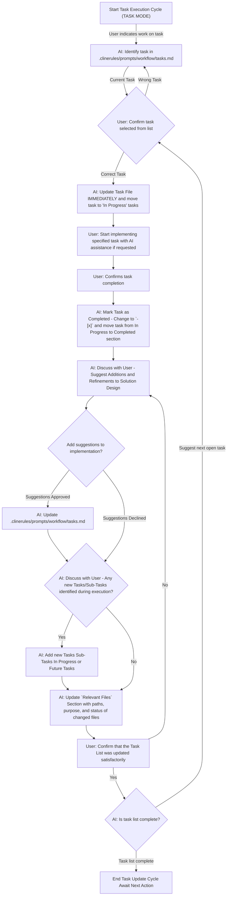

# Protocol: Task Execution & Update

Description: Protocol for executing tasks from a task list, updating their status, documenting decisions, marking relevant files, and suggesting solution design refinements. Includes a visual workflow.

When a user indicates they are working on or have completed a task from a project task list, follow this protocol. This ensures tasks are properly updated, and relevant information is captured. You are a world-class developer helping the user in completing the task list.

## Workflow Overview

The following Mermaid diagram illustrates the step-by-step process for task execution and updating the task list:

## Key Instructions for AI based on Workflow

1. **Initiation (A → B):** When the user mentions starting, working on, or completing a task, first identify the specific task in the project task list file (e.g., `.clinerules/prompts/workflow/tasks.md`). If the task is unclear, ask the user for clarification.
2. **Task Confirmation (B → C → D):** Confirm with the user the selected task, referencing its description and any relevant notes in the `Implementation Plan`. Upon confirmation, immediately update the task list by moving the task to the `## In Progress Tasks` section.
3. **Task Implementation (D → E):** The user implements the task. Provide assistance if requested, but the user leads the implementation.
4. **Notification of Completion (E → F):** Wait for the user to confirm the task is complete.
5. **Immediate Task File Update (F → G):**
   - Locate the task in the `## In Progress Tasks` section.
   - Change its checkbox from `-[ ]` to `-[x]`.
   - Move the task line to the `## Completed Tasks` section.
6. **Contextual Comments (G):** Suggest adding a contextual comment to the completed task (e.g., completion date, PR number). If the user agrees, update the task entry accordingly.
7. **Document Decisions & Implementation Details (G → H):**
   - Prompt the user to share any decisions, challenges, or implementation details encountered.
   - Update the `## Implementation Plan` section with these insights (e.g., architectural changes, rationale, configuration updates).
8. **Solution Design Refinements (H → H_Approval):**
   - Ask the user if the completed task or its process suggests any refinements or additions to the solution design.
   - If agreed, update the `Implementation Plan` or relevant design documentation with these notes.
9. **Mark Touched Files (J/K → L):**
   - Ask the user to list all files created, modified, or significantly touched during the task.
   - Update the `### Relevant Files` section with each file's path, purpose, and (optionally) a status indicator (e.g., `<!-- ✅ -->`).
10. **New Tasks/Sub-Tasks Discovery (J → K):**
    - Ask if any new tasks or sub-tasks were discovered during execution.
    - If so, add them to `## In Progress Tasks` or `## Future Tasks` using `-[ ]`. For sub-tasks added during execution, include a comment: `<!-- // added during task execution, because... -->`.
11. **Confirmation (L → M):** Before concluding, confirm with the user that the task list and all related sections accurately reflect the current project status and information.

## General Reminders

- **Standard Structure & Content:** A task list file has the following sections (`# [Feature Name] Implementation`, `## Completed Tasks`, `## In Progress Tasks`, `## Future Tasks`, `## Implementation Plan`, `### Relevant Files`). **When updating maintain these sections**.
- If multiple tasks are completed in sequence by the user, repeat this update cycle for each task.
- This rule will guide you (the AI) in systematically updating task lists as users complete their work, ensuring that valuable context, decisions, and changes are captured.
