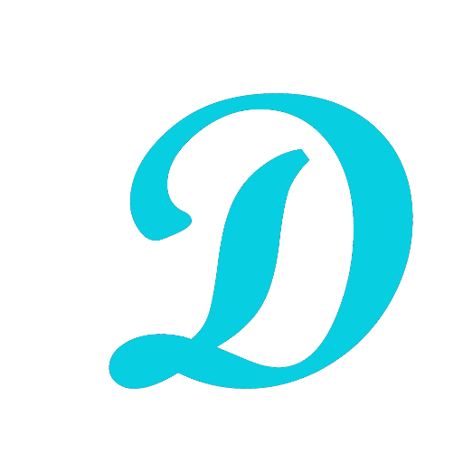

  

---

   

# Frickeldave

The frickeldave site is a mix of personal blog, portfolio, IT topics, diy topics and everything else i want to write about. Also it's a place for experimenting with astro and starlight.

## Technology

Frickeldave is based on [Astro](https://astro.build/) and uses the Astro theme [Astrogon](https://github.com/astrogon/astrogon). This is a rapidly-customizable multipurpose website template built using Astro JS, Tailwind, and a sprinkle of React.

## License

The frickeldave website and Astrogon is licensed under the [MIT License](LICENSE).

### Used fonts

This project uses the following fonts:

- **Cormorant** © Catharsis Fonts – [SIL Open Font License, Version 1.1](https://scripts.sil.org/OFL)
- **Inter** & **Inter Display** © Rasmus Andersson – [SIL Open Font License, Version 1.1](https://scripts.sil.org/OFL)
- **Noto Sans** & **Noto Serif** © Google – [SIL Open Font License, Version 1.1](https://scripts.sil.org/OFL)
- **Open Sans** © Steve Matteson – [Apache License, Version 2.0](https://www.apache.org/licenses/LICENSE-2.0)

For details, please refer to the respective license links above.

